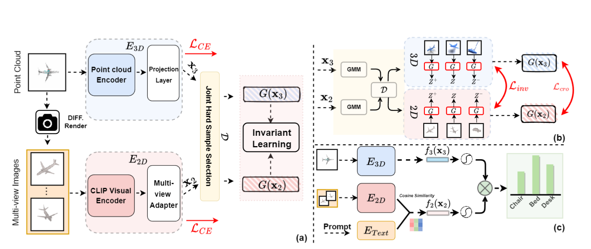

**This is the official Pytorch implemenation of "Invariant Training on Joint Hard samples for Few-shot 3D Shape Recognition".**

*I've recently been busy preparing my submissions for ICLR as well as expanding the paper's content ( point cloud detection and part segementation) for journal publication.* 

The arxiv version of this paper will be available in August. The code will be open-sourced later this year.

  

